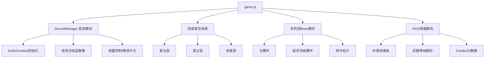

## 产品概述

为现有的飞机大战游戏添加音效系统和视觉增强，提升游戏体验的沉浸感和表现力。

## 核心功能

- **音效系统**：使用 Web Audio API 合成音效，无需外部音频文件。包含射击音效（按武器类型区分）、敌人击毁音效、玩家受击音效、道具拾取音效、Boss警告音效、Boss击毁音效、波次开始音效、护盾激活/破碎音效、游戏结束音效等。
- **背景层次增强**：为星空背景增加多层视差滚动（远景星云、中景星尘、近景亮星），增加深空星云色块，营造纵深氛围感。
- **Boss死亡动画增强**：将Boss死亡从单次爆炸改为多阶段连环爆炸（延迟引爆多个爆炸点），增加碎片飞散效果，增强屏幕震动和闪光。
- **HUD改进**：添加护盾剩余时间进度条、武器等级/类型可视化图标、连杀Combo计数器显示。

## 技术栈

- 保持现有项目架构：Vanilla JS + Canvas 2D + HTML/CSS，无构建步骤
- 音效：Web Audio API（AudioContext + OscillatorNode + GainNode）合成音效，零外部依赖
- 视觉：Canvas 2D 渲染增强，复用现有粒子/爆炸基础设施

## 实现方案

### 音效系统设计

创建 `SoundManager` 对象，使用 `AudioContext` 生成合成音效。每种音效通过不同频率、波形、增益包络组合实现：

- **射击音效**：短脉冲高频方波 + 快速衰减（不同武器用不同频率/时长区分）
- **爆炸音效**：低频噪声脉冲 + 渐衰减（大爆炸加长持续时间）
- **受击音效**：短促低频锯齿波 + 金属质感
- **道具音效**：上升音阶正弦波 + 轻快包络
- **Boss警告**：交替高低频脉冲 + 重复节奏
- **护盾音效**：柔和正弦波上升 + 破碎时快速下降

所有音效使用增益节点控制音量和衰减，避免突兀。提供全局音量控制和静音开关（菜单中可切换）。

### 视觉增强设计

**背景层次**：将现有单层星空扩展为三层视差系统：

- 远景层：大尺寸低亮度慢速星云色块（蓝色/紫色渐变椭圆），速度0.3-0.5
- 中景层：中等星尘点，速度0.8-1.5，略带颜色变化
- 近景层：现有亮星，速度1.5-3.0，保持白色高亮度

**Boss死亡动画**：在 `destroyBoss()` 中实现多阶段爆炸：

- 阶段1：Boss位置主爆炸（大范围径向渐变）
- 阶段2：延迟0.3s后Boss周围2-4个次级爆炸点
- 阶段3：延迟0.6s后碎片飞散（金属色粒子+旋转矩形碎片）
- 增强屏幕震动（从20提升到30+持续衰减）和闪光（多层叠加）

**HUD改进**：

- 护盾进度条：在HP条下方添加金色进度条，显示shieldTimer剩余比例
- 武器可视化：武器名旁添加小色块图标 + 等级指示（Lv.0/1/2）
- Combo计数器：右上角附近显示当前连杀数（2秒内连续击杀累计），带倍率加成

## 实现注意事项

- Web Audio API 需要 `AudioContext`，首次调用需在用户交互后创建（浏览器政策），在 `startGame()` 中初始化
- 音效播放需控制并发数量，避免过多 `OscillatorNode` 同时运行导致性能问题，建议最多同时8个音效节点
- 视差星空在 `initStars()` 中重构，保持现有星星数量同时新增星云和中景层，`drawStars()` 分层绘制
- Boss多阶段爆炸使用 `setTimeout` 延迟触发（已有此模式在 `destroyBoss` 的道具掉落中），或用帧计时器实现更精确的控制
- HUD新元素在 `index.html` 中添加DOM节点，`style.css` 中添加样式，`updateHUD()` 中更新数据

## 架构设计

保持现有单文件架构，在 `game.js` 中按区域组织新增代码：



## 目录结构

```
planeWar/
├── index.html    # [MODIFY] 添加护盾进度条DOM、武器图标DOM、Combo显示DOM、静音按钮
├── style.css     # [MODIFY] 添加护盾进度条样式、武器图标样式、Combo显示样式、静音按钮样式
├── game.js       # [MODIFY] 主要修改文件，包含以下新增/修改区域：
│   ├── SoundManager对象      # [NEW] 音效管理器，Web Audio API合成音效
│   ├── initStars()           # [MODIFY] 扩展为三层视差星空（星云+星尘+亮星）
│   ├── updateStars()         # [MODIFY] 分层更新速度
│   ├── drawStars()           # [MODIFY] 分层绘制（星云渐变椭圆+星尘+亮星）
│   ├── destroyBoss()         # [MODIFY] 多阶段连环爆炸+碎片+增强震动闪光
│   ├── destroyEnemy()        # [MODIFY] 添加Combo累计逻辑+音效调用
│   ├── hitPlayer()           # [MODIFY] 添加受击音效+火花粒子
│   ├── collectPowerup()      # [MODIFY] 添加道具音效
│   ├── playerShoot()         # [MODIFY] 添加射击音效（按武器类型区分）
│   ├── startBossFight()      # [MODIFY] 添加Boss警告音效
│   ├── updateHUD()           # [MODIFY] 更新护盾进度条、武器等级、Combo显示
│   ├── update()              # [MODIFY] Combo计时器衰减
│   ├── startGame()           # [MODIFY] 初始化AudioContext
│   └── 菜单按钮事件           # [MODIFY] 添加静音切换按钮事件
```

## 设计风格

保持现有太空战斗主题的赛博朋克深空风格，在此基础上增强层次感和动态表现力。

## 背景层次设计

- 远景星云层：半透明蓝紫色渐变椭圆色块，缓慢向下飘移，营造深空纵深感
- 中景星尘层：微弱的多色星点（蓝白、淡紫、淡金），中速流动
- 近景亮星层：现有白色高亮星点，保持最快速度，维持战斗空间感

## Boss死亡动画设计

- 主爆炸：大范围径向渐变闪光（白色核心→橙红→暗红消散）
- 次级爆炸：Boss轮廓周围2-4个延迟引爆点，每个带独立环状冲击波
- 碎片飞散：金属色（银灰+橙红）矩形碎片粒子，带旋转和拖尾
- 屏幕效果：强震（30像素振幅缓慢衰减）+ 多层白色闪光叠加

## HUD改进设计

- 护盾进度条：HP条下方，金色渐变填充，暗色轨道背景，圆角设计
- 武器可视化：武器名称旁显示对应颜色小方块图标 + Lv等级文字
- Combo计数器：屏幕右上区域，大号数字显示连杀数，超过5时文字放大+颜色变亮，附带分数倍率提示

## 静音按钮设计

- 菜单界面右下角小型喇叭图标按钮，游戏进行时HUD右上角缩小版
- 开启时显示喇叭图标，关闭时显示静音图标（×标记）
- 点击切换，状态保存到localStorage